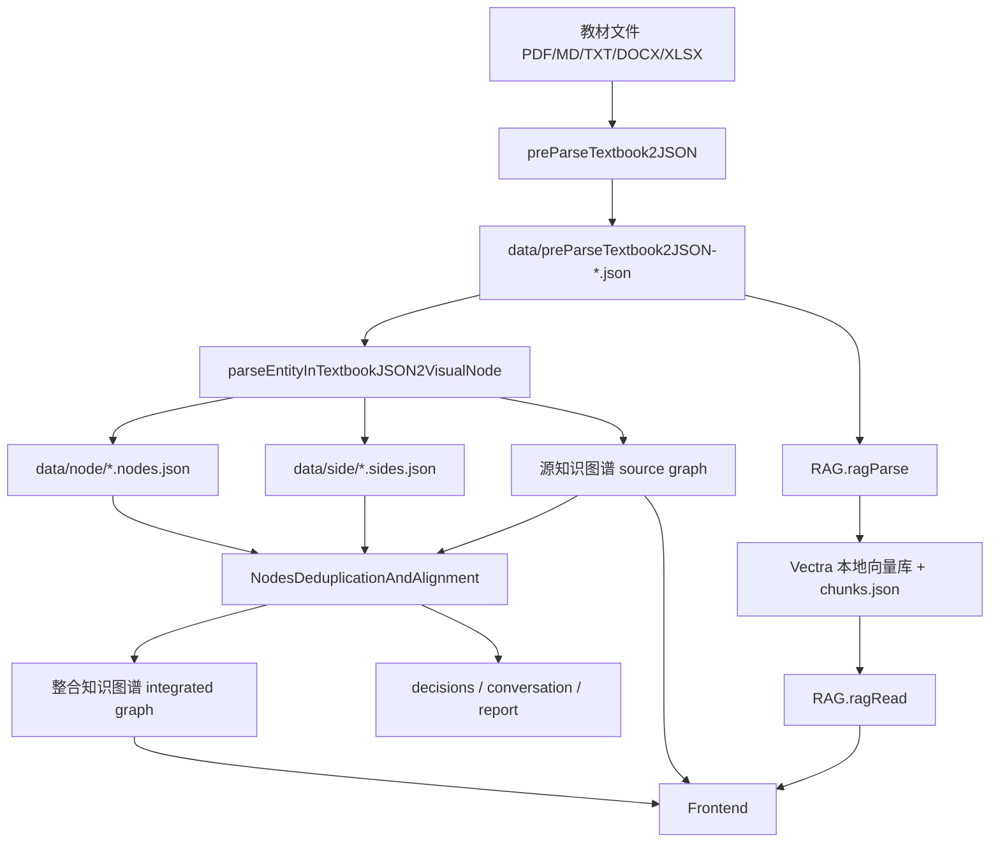
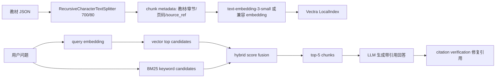

# Agent 架构说明

## 架构总览



系统采用五个核心模块串联的 Agent 流程：

| 模块 | 责任 | 输入 | 输出 |
| --- | --- | --- | --- |
| `preParseTextbook2JSON` | 将教材文件解析为统一章节 JSON | PDF/MD/TXT/DOCX/XLSX/XLS/CSV/TSV | `data/preParseTextbook2JSON-*.json` |
| `parseEntityInTextbookJSON2VisualNode` | 调用 LLM 抽取知识点和四类事实关系 | 教材 JSON + LLM | `node/*.nodes.json`、`side/*.sides.json`、源图谱 |
| `NodesDeduplicationAndAlignment` | 召回候选、执行 necessity gate、生成整合决策 | 源图谱 + 教师反馈 + LLM | 整合图谱、决策历史、对话历史 |
| `RAG` | 分块、embedding、混合检索、带引用回答 | 教材 JSON + embedding + LLM | Vectra 索引、chunks、RAG 回答 |
| `Frontend` | 提供上传、图谱交互、整合、RAG 和报告入口 | 后端 API | Cytoscape/ECharts 可视化界面 |

本项目没有硬拆成多个自治 Agent，而是采用“模块化单 Agent 编排”。原因是赛题的关键路径高度顺序化：教材解析必须先产出章节 JSON，图谱抽取依赖章节 JSON，整合依赖图谱，RAG 依赖教材原文和索引。用一个编排层串联多个职责清晰的 domain 模块，可以减少跨 Agent 通信和状态同步成本，同时让每个模块拥有独立 prompt、输入 schema 和错误处理边界。

## 数据流

1. 教材上传后，后端写入 `tmp/frontend-upload-*.{ext}`，随后解析为 `data/preParseTextbook2JSON-*.json`。
2. 图谱抽取读取教材 JSON，以章节为单位调用 LLM，写入 `data/node/{book}.nodes.json` 与 `data/side/{book}.sides.json`。
3. 前端默认展示源图；自动去重或教师反馈会调用 `NodesDeduplicationAndAlignment`，生成当前整合图和 decisions/conversation。
4. RAG 索引读取同一批教材 JSON，使用 `RecursiveCharacterTextSplitter` 分块并写入 `data/rag/chunks.json` 和 `data/rag/vector/index.json`。
5. RAG 问答先做向量 + BM25 混合检索，再调用 LLM 生成回答，最后由 citation verification 删除虚假引用并补齐真实来源。

## 关键接口定义

| 接口 | 输入 | 输出 | 在 Agent 链路中的作用 |
| --- | --- | --- | --- |
| `POST /api/frontend/uploadTextbookBinary` | 教材二进制文件 | 教材 JSON 摘要、解析状态 | 进入系统的文件入口 |
| `POST /api/llm/configLLM` | endpoint、apiKey、defaultModel | `llm.id` | 后续 LLM 调用只传 ID |
| `POST /api/parseEntityInTextbookJSON2VisualNode/parseEntityInTextbookJSON2VisualNode` | `llmId`、教材 JSON、节点上限 | 节点、关系、统计信息 | 把教材章节转为知识图谱 |
| `POST /api/NodesDeduplicationAndAlignment/NodesDeduplicationAndAlignment` | `llmId`、教师提示、目标节点 | 整合决策、压缩比、图谱变化 | 执行去重提纯和反馈修正 |
| `POST /api/rag/index` | `llmId` 或 embedding 配置 | RAG manifest、chunk/向量文件 | 建立教材知识库 |
| `POST /api/rag/query` | `llmId`、问题 | 回答、引用、source chunks | 基于教材原文问答 |

## 设计决策论证

### RAG 向量库选择

| 方案 | 优点 | 风险 | 结论 |
| --- | --- | --- | --- |
| Vectra 本地索引 | 文件型存储、零外部服务、可直接提交/复现 `data/rag` 结果；支持向量检索并可追加 BM25 候选 | 不适合超大规模在线多租户 | 本项目数据量是教材级，选 Vectra 可降低部署门槛 |
| Faiss | 高性能、适合大规模向量检索 | Node.js 集成和跨平台安装成本较高，Docker 镜像更重 | 黑客松复现优先级高于极限性能，暂不采用 |
| Chroma | 功能完整，适合服务化向量数据库 | 需要额外服务或持久化配置，评委本地启动链路变长 | 当前只需本地单机索引，收益不足以抵消复杂度 |

### 图谱可视化选择

| 方案 | 优点 | 风险 | 结论 |
| --- | --- | --- | --- |
| Cytoscape | 图论场景成熟，节点/边样式、拖拽、缩放、布局和邻域高亮开箱即用 | 统计图能力弱，需要配合其他库 | 主图谱选 Cytoscape，保证交互稳定 |
| D3 | 自由度高，适合定制力导向和复杂视觉编码 | 需要手写大量拖拽、缩放、布局和命中逻辑 | 黑客松时间内维护成本高 |
| ECharts | 矩阵、桑基、时间轴等统计视图成熟 | 不适合作为主交互知识图谱 | 用于辅助洞察视图，与 Cytoscape 互补 |

### 分块策略选择

| 参数 | Top-5 命中 | 索引块数 | 评价 |
| --- | --- | ---: | --- |
| 500 / 50 | 3/3 | 9 | 命中稳定，但块数更多，重复上下文和 embedding 成本更高 |
| 700 / 80 | 3/3 | 6 | 命中稳定，能容纳定义、机制和短例子，索引规模适中 |
| 800 / 100 | 3/3 | 6 | 命中稳定，但单块更长，回答时可能带入更多无关上下文 |

对比方法：使用本地确定性 keyword embedding，对“动作电位如何传导”“细胞膜结构由哪些成分组成”“内环境稳态如何维持”三个查询分别测试 `500/50`、`700/80`、`800/100`。三组均 Top-5 命中正确章节；默认采用 `700/80`，因为它位于赛题要求的 500-800 字与 50-100 字重叠中段，在命中率、上下文完整性和索引体量之间更平衡。

### 去重判定选择

| 方案 | 优点 | 风险 | 结论 |
| --- | --- | --- | --- |
| 纯 LLM 判定 | 能理解同义词、简称和上下文 | 容易受 prompt 波动影响，也可能误合并上下位概念 | 不单独使用 |
| 纯 lexical 判定 | 可解释、速度快、成本低 | 难处理“动作电位/锋电位”等同义表达 | 只作为候选召回 |
| lexical + LLM + necessity gate | 先缩小候选，再做语义判断，并强制说明必要性 | 实现复杂度略高 | 当前采用，兼顾成本、准确性和可解释性 |

## RAG Pipeline 设计



实现细节：

| 环节 | 当前实现 |
| --- | --- |
| 分块 | `@langchain/textsplitters` 的 `RecursiveCharacterTextSplitter`，默认 `chunkSize=700`、`chunkOverlap=80`，并校验参数必须位于赛题范围 |
| Embedding | 默认 `text-embedding-3-small`，支持 OpenAI-compatible endpoint，也支持请求级自定义 `embeddings` 对象 |
| 存储 | `vectra` LocalIndex 写入 `data/rag/vector/index.json`，chunk 正文写入 `data/rag/chunks/*.txt` 与 `chunks.json` |
| 检索 | 向量候选 + BM25 候选融合，默认 top-5 返回给回答模型 |
| 防幻觉 | `verifyAndRepairAnswerCitations` 会移除不存在的引用，并把检索到的合法 `source_ref` 补回回答 |

## Prompt 工程

### 知识点抽取 Prompt

System 约束聚焦三件事：角色、关系枚举和严格 JSON。

```text
你是医学与理工教材知识图谱抽取助手。
任务：从单个教材章节中抽取核心知识点和知识点关系，只输出严格 JSON 对象。
关系类型只能使用 prerequisite、parallel、contains、applies_to 四种。
关系必须来自章节正文中可支持的真实知识关系；不要为了凑关系类型数量而猜测或补全关系。
不要输出 Markdown、解释文字或额外字段。
```

User prompt 会附带教材 ID、章节 ID、页码范围、输出 schema、每章节点上限、few-shot 示例和章节正文。few-shot 覆盖“静息电位、动作电位、钠通道开放”，同时展示 `prerequisite`、`contains`、`parallel` 三类典型关系，帮助模型稳定输出可解析结构。

### 整合判定 Prompt

System 约束要求单次只围绕一个 target node 决策，并先给出必要性判断。

```text
你是教材知识图谱的跨教材去重与教师反馈处理助手。
任务：只围绕 target_node 做一次节点级整合决策，不要一次性处理多个无关节点。
必须先判断是否有必要整合或删除，再决定 action；没有必要时必须 action=keep。
必须按语义等价判断：同义词、外文名、简称、表述差异可以合并；上下位、前置依赖、应用场景不同则不要合并。
教师反馈优先：如果用户要求保留、恢复或分开节点，action 用 keep；如果要求删除冗余节点，action 用 remove。
action 只能是 merge、keep、remove。
```

User message 使用 JSON 包含 `user_prompt`、`inferred_prompt_action`、`target_node`、`candidate_nodes`、`current_stats`、最近 5 条 `recent_decisions` 和输出 schema。这样设计有三个目的：严格 JSON 降低解析失败；few-shot 和枚举关系降低自由发挥；`inferred_prompt_action` 为教师反馈提供提示锚点，减少模型做出反直觉决策。

## Agent 反思与校验机制

- Necessity gate：`merge/remove/keep` 前必须显式返回 `necessity.necessary` 与 `necessity.reason`。如果缺失，后端抛出 `NEED_NECESSITY_JUDGEMENT`，避免模型直接给出不可解释操作。
- Citation verification：RAG 回答后会用正则抽取引用，与检索 chunk 的 `source_ref` 白名单比对。不存在的引用会被删除，缺失引用会由真实检索来源补齐。
- 教师反馈闭环：对话接口会把教师指令、目标节点、候选节点、决策和结果持久化，下一次整合 prompt 会带最近决策，形成可追溯迭代。

## 创新点

### 1. Necessity Gate 必要性先行

做了什么：整合模块要求 LLM 在任何 `merge`、`remove`、`keep` 决策前必须输出 `necessity.necessary` 和 `necessity.reason`。后端 `explicitNecessity` 会在运行时校验该字段，缺失时直接抛出 `NEED_NECESSITY_JUDGEMENT`，不会把不可解释的合并写入图谱。

为什么做：跨教材整合最危险的错误是“看起来相似就合并”。必要性先行把模型从“给动作”改为“先证明为什么需要动作”，能降低上下位概念、先修关系、应用场景不同但措辞相近时的误合并风险。

效果：每条决策都能向教师解释“为什么合并/删除/保留”，也为后续教师反馈提供可追溯依据。

### 2. Citation Verification 引用自动校验与补齐

做了什么：RAG 回答生成后，`verifyAndRepairAnswerCitations` 会抽取答案中的 `[教材, 章节, 页码]` 引用，与检索到的 chunk `source_ref` 白名单比对。不存在的引用会被删除；如果答案没有引用，会把真实检索来源补回回答。

为什么做：赛题要求 RAG 回答必须有据可查。仅靠 prompt 要求“带引用”仍可能出现虚构章节或页码，因此需要一个独立于 LLM 的后处理校验层。

效果：前端能展示“引用已校验/已自动补齐”状态，回答、引用列表和原文 chunk 三者保持一致。

### 3. 多视图图谱洞察

做了什么：主图使用 Cytoscape 展示可拖拽交互图谱，同时提供关系矩阵、章节-类别桑基图、章节时间轴和源图/整合图切换。

为什么做：教师既需要查看具体知识点，也需要快速判断章节结构、关系密度和教材重复分布。单一力导向图在节点较多时容易拥挤，多视图能从不同角度解释整合结果。

效果：满足 P1 “多视图切换/桑基图/时间轴”的创新要求，并把节点频次、教材来源、关系类型等多维信息叠加到同一工作台。

## 已知局限与改进

| 优先级 | 局限 | 改进方向 |
| --- | --- | --- |
| P1 | Embedding 默认依赖 OpenAI-compatible 接口，未内置本地 BGE/E5 模型 | 增加 Transformers.js 或本地 embedding adapter |
| P1 | Dice 二元 n-gram 对很短中文名可能误判相似度 | 引入 SimHash、拼音/英文别名词典或领域同义词表 |
| P1 | 单轮整合只处理一个 target node，跨章节冲突需要多轮收敛 | 增加批量计划器，先聚类再按簇生成决策 |
| P2 | RAG 参数对比目前是本地小样本验证，未形成大规模 benchmark | 增加固定问题集和命中率/引用正确率自动评测脚本 |
| P2 | 前端暂无多人协同和权限隔离 | 引入 sessionId、用户角色和决策审计视图 |
