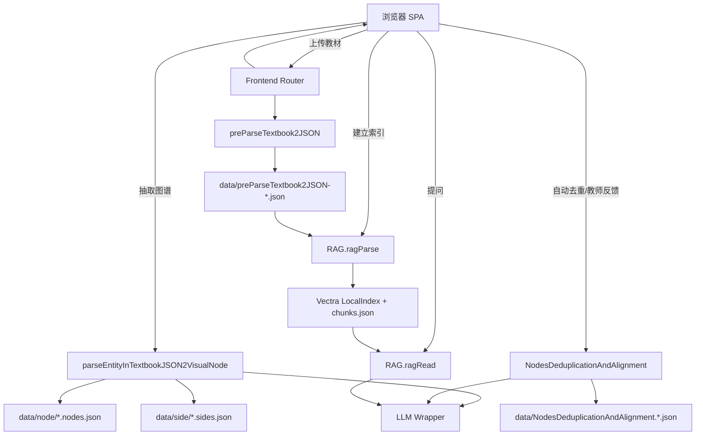

# 系统设计

## 1. 系统架构



系统采用 Node.js + Express 后端和原生 HTML/CSS/ESM 前端。后端按 domain 拆分业务能力，app 层只负责 HTTP 路由、文件落盘和错误响应；前端是单页应用，左侧教材管理、中间知识图谱、右侧整合/RAG/对话/报告 Tab，符合赛题建议布局。

## 2. 数据流

| 阶段 | 输入 | 处理 | 输出 |
| --- | --- | --- | --- |
| 教材解析 | 前端上传的 PDF/MD/TXT/DOCX/XLSX/XLS/CSV/TSV | `preParseTextbook2JSON` 解析章节、页码、字数 | `data/preParseTextbook2JSON-*.json` |
| 图谱抽取 | 教材 JSON + LLM | 每章单独 prompt，限制每章最多 12 个节点，输出严格 JSON | `data/node/*.nodes.json`、`data/side/*.sides.json` |
| 图谱展示 | node/side JSON | 前端聚合源图或整合图，Cytoscape 渲染 | 交互式图谱、详情面板、统计卡片 |
| 跨教材整合 | 源图谱 + 教师提示 + LLM | lexical 候选召回、LLM 等价判断、necessity gate 校验 | 整合节点/关系、决策历史、压缩统计 |
| RAG 索引 | 教材 JSON | 700/80 分块、embedding、Vectra 本地索引 | `data/rag/manifest.json`、`chunks.json`、`vector/index.json` |
| RAG 问答 | 用户问题 + RAG 索引 + LLM | vector + BM25 混合检索 top-5，生成回答并校验引用 | 回答正文、引用列表、source chunks |
| 报告生成 | 教材、图谱、整合、RAG 状态 | 汇总字数、压缩比、决策、案例、教学完整性 | `report/整合报告.md` |

## 3. 技术选型及理由

| 层 | 技术 | 理由 |
| --- | --- | --- |
| 后端 | Express 5 + Node.js ESM | 启动轻、部署简单，适合 5 小时黑客松快速交付 Web API |
| 前端 | 原生 HTML/CSS/ESM | 减少构建链路，评委 `npm start` 后即可访问，不需要额外前端打包 |
| 文件解析 | `pdfjs-dist`、`mammoth`、`xlsx` | 覆盖赛题要求的 PDF/Markdown/TXT，并支持 Word/Excel 加分格式 |
| LLM | OpenAI-compatible SDK 包装 | 能接入 OpenAI、DeepSeek、通义千问等兼容接口；业务 API 只传 `llmId`，不重复暴露密钥 |
| 图谱 | Cytoscape.js + ECharts | Cytoscape 负责专业图交互，ECharts 负责矩阵、桑基、时间轴等统计视图 |
| RAG | LangChain splitter + Vectra | splitter 满足 500-800/50-100 的赛题约束；Vectra 是本地文件索引，便于复现和 Docker 部署 |
| 部署 | `npm start` + Docker Compose | 本地、服务器和容器使用同一启动入口，降低部署差异 |

本地默认监听 `127.0.0.1:3000`；Docker Compose 会把 `HOST` 设置为 `0.0.0.0`，使容器端口可以正确映射到宿主机。

## 4. API 接口一览

| 方法 | 路径 | 说明 |
| --- | --- | --- |
| `GET` | `/api/health` | 服务健康检查 |
| `POST` | `/api/frontend/uploadTextbookBinary` | 前端上传教材并解析落盘 |
| `GET` | `/api/frontend/textbooks` | 列出已解析教材 |
| `GET` | `/api/frontend/graph?scope=source|integrated` | 获取源图或整合图 |
| `GET` | `/api/frontend/report` | 生成并返回整合报告 |
| `POST` | `/api/llm/configLLM` | 注册 OpenAI-compatible LLM |
| `POST` | `/api/preParseTextbook2JSON/preParseTextbook2JSON` | 解析教材为统一 JSON |
| `POST` | `/api/parseEntityInTextbookJSON2VisualNode/parseEntityInTextbookJSON2VisualNode` | 抽取知识点和关系 |
| `POST` | `/api/NodesDeduplicationAndAlignment/NodesDeduplicationAndAlignment` | 执行整合或教师反馈 |
| `POST` | `/api/rag/index` | 建立 RAG 索引 |
| `POST` | `/api/rag/query` | RAG 问答 |
| `GET` | `/api/rag/status` | 查询索引状态 |

详细请求/响应示例见 [API 说明](API.md)。

## 5. 关键输入输出示例

教材解析输出：

```json
{
  "textbook_id": "book_01",
  "filename": "生理学.pdf",
  "title": "生理学",
  "total_pages": 520,
  "total_chars": 385000,
  "chapters": [
    {
      "chapter_id": "ch_01",
      "title": "第一章 绪论",
      "page_start": 1,
      "page_end": 15,
      "content": "生理学是研究生物体正常生命活动规律的科学...",
      "char_count": 8500
    }
  ]
}
```

整合决策输出：

```json
{
  "decision_id": "merge_001",
  "action": "merge",
  "affected_nodes": ["book01_node_015", "book03_node_032"],
  "result_node": "merged_node_001",
  "reason": "两个节点均描述同一核心概念，定义互补且来源可追溯。",
  "confidence": 0.92,
  "necessity": {
    "necessary": true,
    "reason": "重复节点会造成学生重复阅读，需要合并。"
  }
}
```

RAG 问答输出：

```json
{
  "answer": "炎症是机体对损伤因子产生的防御性反应。来源：[病理学, 第四章 炎症, 第 78 页]",
  "citations": [
    {
      "textbook": "病理学",
      "chapter": "第四章 炎症",
      "page": 78,
      "relevance_score": 0.92
    }
  ],
  "source_chunks": ["炎症(inflammation)是具有血管系统的活体组织对各种损伤因子的刺激..."]
}
```

## 6. 部署与运行

本地运行：

```bash
npm install
npm start
```

Docker 运行：

```bash
cp .env.example .env
docker compose up -d
```

运行后访问 `http://127.0.0.1:3000/`。比赛正式提交时需要提供公网可访问部署链接，本地地址只用于开发和复现。
